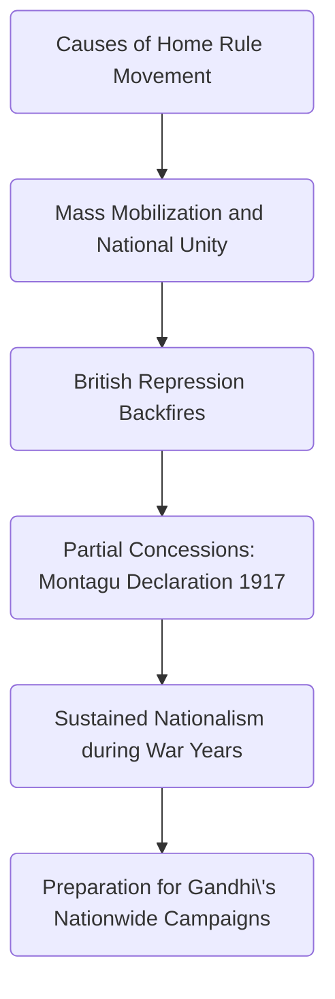

# Home Rule Movement (1916-18)

## Basic Information

Home Rule was a political movement demanding autonomy for India within the British Empire, focusing on internal self-government (control over domestic affairs) while allowing Britain to retain power over defence and foreign policy.  
Unlike other full independence movements that happened in India, Home Rule was a modest, achievable goal to avoid arousing British alarm.

### Key Feature

- **None-revolutionary** (aims for self rule, but not total independence from British Crown)
    
- Mass Mobilization
    
- Inspired by Ireland
    

---

## Causes of the Home Rule Movement

### Political Stagnation of the ==Indian National Congress==

After the split between moderates and extremists in 1907, Congress lost momentum. Moderates dominated and avoided radical demands such as autonomy.  
_"Besant tried to work with Congress to revive its fortunes, but she soon realised that Congress was only interested in controlling and suppressing the home rule movement."_  
This stagnation pushed leaders like ==Tilak== and ==Besant== to create alternative organizations (Home Rule Leagues) to bypass Congress’s inaction.

### Inspiration from Irish Home Rule

The success of Ireland’s campaign showed that self-government within the Empire was possible.  
_"The home rule leagues were based closely on the campaigns for home rule in Ireland... It took four attempts between 1886 and 1914 for an Irish Home Rule Bill to become law."_  
This success made local self-government appear to be a realistic rather than a marginal requirement.

### Impact from WW1

India's wartime contribution (1.3 million troops and resources) raised expectations of political returns.  
==Tilak== argued:  
_"If you want Home Rule, be prepared to defend your Home... You cannot say the ruling will be done by you and the fighting for you."_  
This highlighted the hypocrisy of demanding Indian loyalty while denying self-government.

---

## Consequences of the Home Rule Movement

### Mass Mobilization and National Unity

The leagues educated and politicized the public on a scale Congress had never achieved.  
_"Both [Tilak and Besant] set up branches in towns and villages to promote political education through discussion groups, lectures, and pamphlets... Within a year, 60,000 people had joined."_  
This created India’s first nationwide political campaign, uniting regions like Maharashtra (==Tilak==) and Madras (==Besant==).

### British Repression Backfired

Arrests of leaders like ==Besant== (interned in 1917) and ==Tilak== (charged with sedition) sparked outrage.  
_"Besant’s internment... sparked wide condemnation. Many prominent leaders, including ==Jinnah==, joined the leagues."_  
The crackdown radicalized moderates and forced the British to issue the ==Montagu Declaration (1917)==, promising future self-rule—though it was vague and delayed.

---

## Change and Continuity

### Change

- British conceded on nationalism: went further than the ==Morley-Minto Reform (1909)== with the ==Montagu-Chelmsford Reform (1919)==.
    
- Made the ==INC== adopt the concept of Home Rule as a goal.
    
- Greater unity among nationalists:
		
	- reconciliation between the moderates and extremists by ==Tilak== through the ==Lucknow Pact (1916)==.
	    
	- Agreement between the ==INC== and the ==Muslim League== reached through the effort of ==Mohammad Ali Jinnah==.
    

### Continuity

- India was still ruled by ==British India==.
    
- The underlying conflicts between ==INC== and ==Muslim League== still existed, although temporarily suppressed.
    

---

## Significance

- Its failure left an unsatisfied willingness among the general population for more direct action.
    
- Widely believed to have prepared the way for the nationwide campaigns of ==Gandhi== from the 1920s onwards.
    
- Played a significant role in sustaining the national movement during the war years.
    
- Nudged the British to introduce more reforms like the ==Montagu Declaration (1917)==.
    
- Foster greater unity among nationalists.

