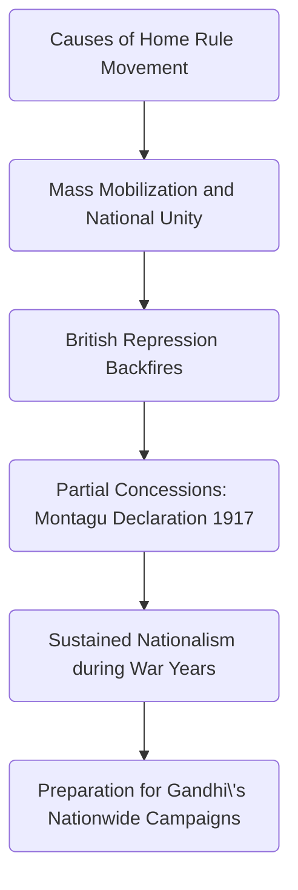

Indian Uprising in 1857 was the first time different groups of Indian united together and rose against British.

---

protests during Partition of Bengal 1905

#### Protest Methods

##### Swadeshi

**aim**: create a feeling of "self-respect"
**actions**: boycott of buying British goods and Lancashire cotton

##### Terrorism

**what happened**:
- In 1908, two European women were killed when a bomb, intended for a local judge, was thrown into the wrong carriage.
- In 1909, the terrorism came to London, when an official at the India Office was shot in the street by a Punjabi seeking political martyrdom.

**Effect**:
- tension in Congress between moderates and radicals

##### Protest's effect

**Congress's aim shifted to independence**, as both radicals and moderates agreed British would never be good to Indians. (Gokhale, leader of the moderates, complained about the lack of consultation over the partition of Bengal.)

**Muslim believed ruling by Hindu will not bring fairness** because of the anger of Muslim majority province creation.

---

# Home Rule Movement (1916-18)

## Basic Information

Home Rule was a political movement demanding autonomy for India within the British Empire, focusing on internal self-government (control over domestic affairs) while allowing Britain to retain power over defence and foreign policy.  
Unlike other full independence movements that happened in India, Home Rule was a modest, achievable goal to avoid arousing British alarm.

### Key Feature

- **None-revolutionary** (aims for self rule, but not total independence from British Crown)
    
- Mass Mobilization
    
- Inspired by Ireland
    

---

## Causes of the Home Rule Movement

### Political Stagnation of the ==Indian National Congress==

After the split between moderates and extremists in 1907, Congress lost momentum. Moderates dominated and avoided radical demands such as autonomy.  
_"Besant tried to work with Congress to revive its fortunes, but she soon realised that Congress was only interested in controlling and suppressing the home rule movement."_  
This stagnation pushed leaders like ==Tilak== and ==Besant== to create alternative organizations (Home Rule Leagues) to bypass Congress’s inaction.

### Inspiration from Irish Home Rule

The success of Ireland’s campaign showed that self-government within the Empire was possible.  
_"The home rule leagues were based closely on the campaigns for home rule in Ireland... It took four attempts between 1886 and 1914 for an Irish Home Rule Bill to become law."_  
This success made local self-government appear to be a realistic rather than a marginal requirement.

### Impact from WW1

India's wartime contribution (1.3 million troops and resources) raised expectations of political returns.  
==Tilak== argued:  
_"If you want Home Rule, be prepared to defend your Home... You cannot say the ruling will be done by you and the fighting for you."_  
This highlighted the hypocrisy of demanding Indian loyalty while denying self-government.

---

## Consequences of the Home Rule Movement

### Mass Mobilization and National Unity

The leagues educated and politicized the public on a scale Congress had never achieved.  
_"Both [Tilak and Besant] set up branches in towns and villages to promote political education through discussion groups, lectures, and pamphlets... Within a year, 60,000 people had joined."_  
This created India’s first nationwide political campaign, uniting regions like Maharashtra (==Tilak==) and Madras (==Besant==).

### British Repression Backfired

Arrests of leaders like ==Besant== (interned in 1917) and ==Tilak== (charged with sedition) sparked outrage.  
_"Besant’s internment... sparked wide condemnation. Many prominent leaders, including ==Jinnah==, joined the leagues."_  
The crackdown radicalized moderates and forced the British to issue the ==Montagu Declaration (1917)==, promising future self-rule—though it was vague and delayed.

---

## Change and Continuity

### Change

- British conceded on nationalism: went further than the ==Morley-Minto Reform (1909)== with the ==Montagu-Chelmsford Reform (1919)==.
    
- Made the ==INC== adopt the concept of Home Rule as a goal.
    
- Greater unity among nationalists:
		
	- reconciliation between the moderates and extremists by ==Tilak== through the ==Lucknow Pact (1916)==.
	    
	- Agreement between the ==INC== and the ==Muslim League== reached through the effort of ==Mohammad Ali Jinnah==.
    

### Continuity

- India was still ruled by ==British India==.
    
- The underlying conflicts between ==INC== and ==Muslim League== still existed, although temporarily suppressed.
    

---

## Significance

- Its failure left an unsatisfied willingness among the general population for more direct action.
    
- Widely believed to have prepared the way for the nationwide campaigns of ==Gandhi== from the 1920s onwards.
    
- Played a significant role in sustaining the national movement during the war years.
    
- Nudged the British to introduce more reforms like the ==Montagu Declaration (1917)==.
    
- Foster greater unity among nationalists.

---

# The Khilafat Movement (1919–1924)

## Brief Overview

### What was the Khilafat Movement?

A pan-Islamic political protest campaign launched by Indian Muslims to defend the Ottoman Caliphate after the defeat of the Ottoman Empire in World War I. It sought to protect the position of the Caliph, who was considered the spiritual head of Muslims worldwide.

### Who was involved?

- Muslim leaders and the **==All-India Khilafat Committee==**
    
- Key figures: ==Maulana Mohammad Ali==, ==Shaukat Ali==, and ==Gandhi==
    
- Also supported by ==Indian National Congress==, especially under ==Gandhi==’s leadership.
    

### When was it formed?

- The All-India Khilafat Conference was held in **November 1919**, launching the Khilafat agitation.
    

### Describe the cooperation between the Khilafat Movement and the Indian Congress

- The **Khilafat Movement** merged with the **Non-Cooperation Movement** led by ==Gandhi==.
    
- In **1920**, the ==Indian National Congress== passed a resolution in support of the Khilafat cause.
    
- The cooperation represented an unprecedented unity between **Hindus and Muslims**, aimed at weakening British rule.
    

---

## Detailed Analysis

### Background and Causes

- The defeat of the **==Ottoman Empire==** in World War I alarmed Indian Muslims.
    
- The British and French were planning to **break up the Ottoman Empire**, creating new states such as Turkey and Iraq. This violated ==Lloyd George==’s earlier promises not to partition or conquer Turkey.
    
- This was seen as an **attack on the international Muslim community**.
    
- Muslim opinion turned **against the British**, leading to mass agitation.
    
- The **==Lucknow Pact==** had earlier fostered Hindu-Muslim political cooperation.
    
- The **Rowlatt Act agitation** touched all communities, further uniting Hindus and Muslims.
    
- ==Gandhi==, genuinely concerned about Muslim grievances, spoke at Khilafat conferences and joined the movement.
    

---

### Leadership and Organisation

- The movement was led by the **==Khilafat Committee==**.
    
- ==Gandhi== became one of the most influential leaders of the Khilafat movement.
    
- On **31 August 1920**, the Khilafat Committee launched the **Non-Cooperation Movement** in conjunction with ==INC==.
    
- A **mass non-cooperation campaign** followed in **1921 and 1922**, characterized by peaceful protests and civil disobedience.
    

#### Methods Promoted by ==Gandhi==

- Boycott of **government educational institutions**, law courts, legislatures.
    
- **Surrender of titles** and **foreign cloth**.
    
- **Promotion of khadi** (hand-spinning and hand-weaving).
    
- **Resignation from government service**.
    
- Mass **civil disobedience**, including **tax refusal**.
    

### Decline and End of the Movement

- In **1921**, British suppression intensified—**over 3,000 people arrested**, including major leaders.
    
- The Khilafat Committee issued a resolution urging members to **"quietly and without any demonstration offer themselves for arrest"** and to **"remain non-violent in word and deed."**
    
- However, violence broke out in 1922—most notably, **burning of a police station** and **death of 22 policemen**.
    
- ==Gandhi== feared this would provoke **widespread British retaliation**, and he believed **India was not yet prepared** for such a confrontation.
    
- On **12 February 1922**, the **==Bardoli Resolution==** was issued, calling to:
    
    - End unlawful protests
        
    - Promote **constructive programmes**:
        
        - Charkha (spinning wheel)
            
        - National schools
            
        - Temperance
            
        - Removal of untouchability
            
        - Hindu-Muslim unity
            
- Despite mixed reactions, the **public largely trusted ==Gandhi==**, and open opposition was minimal.
    

---

### Perspectives

- **==Muslim League==**: Fully supported the ==INC== and its anti-British agenda.
    
- **==Indian National Congress==**: Saw it as a **key moment for Hindu-Muslim unity**.
    
- **British Government**: Declared support for Khilafat illegal; used **violent suppression** (e.g., killing 53 demonstrators, wounding 400).
    
- **==Sikh Akali Movement==**: Ran a **parallel reform campaign** to remove corrupt mahants from Gurudwaras.
    

---

### Significance and Impact

- Brief but **powerful Hindu-Muslim unity** in anti-British struggle.
    
- Contributed significantly to the **Non-Cooperation Movement**.
    
- Drew **urban Muslims, artisans, urban poor, and women** into nationalist politics.
    
- Gave a **psychological boost**—instilled self-confidence and national pride.
    
- ==Gandhi== declared:
    
    > _“The fight that was commenced in 1920 is a fight to the finish, whether it lasts one month or one year or many months or many years.”_
    
- Even **==Lord Reading==**, the viceroy, argued with the British government over the issue.
    
- Eventually led to **mass arrests**—==Gandhi== was arrested on **10 March 1922** and charged with spreading disaffection.
    

